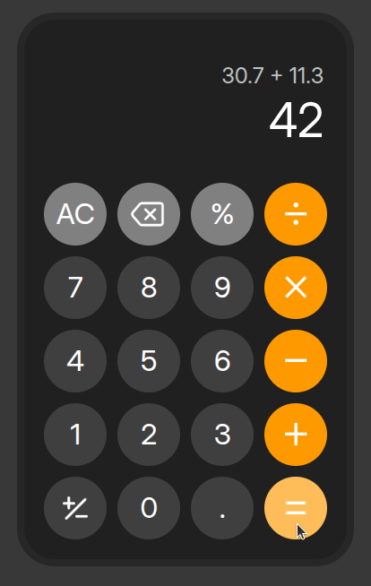
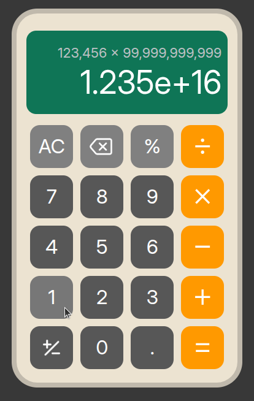
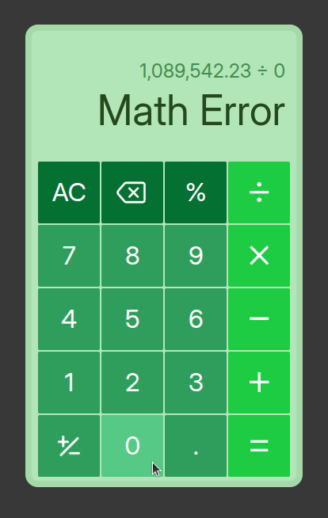
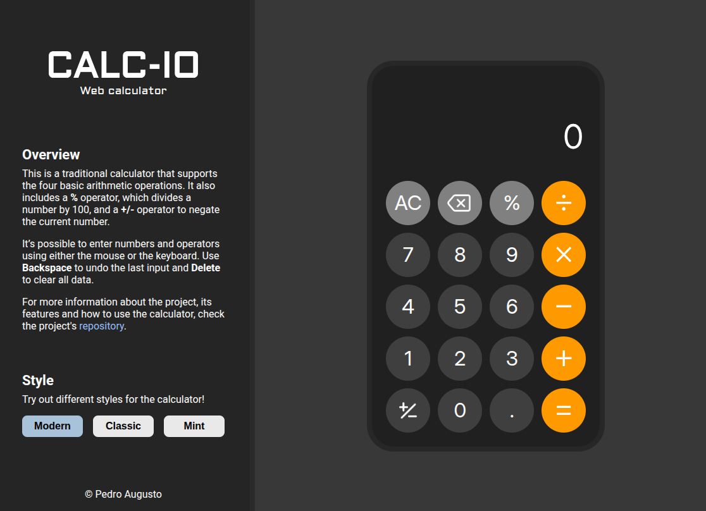
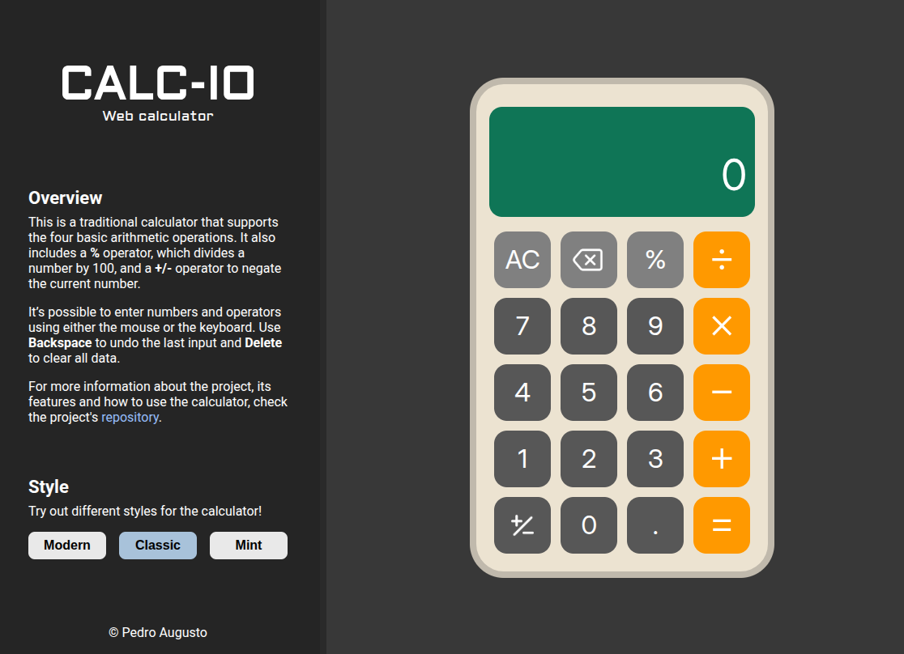
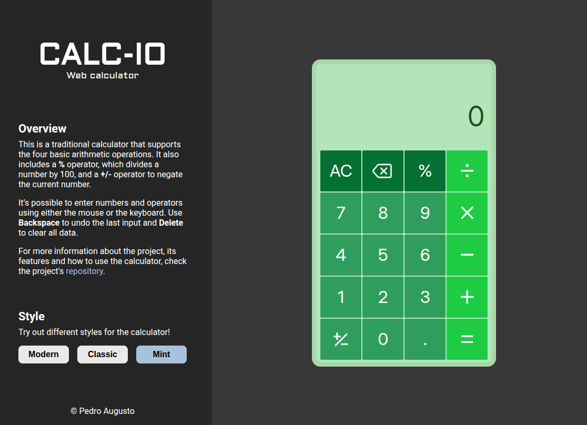

# Calculator

## Description

- HTML + CSS + JavaScript project.
- This is a traditional web-based calculator that supports the four basic math operations (addition, subtraction, multiplication, division). It's possible to interact using either the mouse or the keyboard. Additionally, there are three available styles for the calculator: Modern, Classic and Mint.

## Usage
- The calculator's behavior is intuitive. You can use either the mouse or the keyboard for input. See the table below for all keyboard commands.
- The **%** operator divides the current number by 100.
- The **+/-** operator negates the current number.
- Decimal numbers can be entered by pressing the dot (**.**) button.
- Use **Backspace** to undo the last input.
- Use **Delete (AC)** to clear all data.

| Input/Action | Keyboard button |
| :--- | :--- |
| Digits from **0** to **9** | `0-9` (respectively) |
| **.** (input decimals) | `.` |
| **&plus;** (addition) | `+` |
| **&minus;** (subtraction) | `-` |
| **&times;** (multiplication) | `*` |
| **&divide;** (division) | `/` |
| **&equals;** (show result) | `=` or `Enter` |
| **&percnt;** (divide by 100) | `Ctrl` |
| **+/-** (negate) | `Shift` |
| Undo last input | `Backspace` |
| Clear all data (AC) | `Delete` |

## Features
### Functioning
- The calculator is stack-based, i.e., numbers and operators entered by the user are pushed onto a stack, which is implemented as a JavaScript object.
- The **AC** button effectively clears all data, including last result buffer and the calculator's stack.
- If the user presses multiple binary operators in a row (****&plus;****, **&minus;**, **&times;**, or **&divide;**), the last one is used for the next operation.
- After displaying a result using the equals (**&equals;**) button, entering a new digit clears the current result and begins a new operation, i.e., it starts a new operand.
- After displaying a result using the equals (**&equals;**) button, pressing a binary operator (**&plus;**, **&minus;**, **&times;**, or **&divide;**) immediately uses the result as the first operand in the next operation.
- **Chained operations:** after an input like "**A operator B**", pressing another binary operator (**&plus;**, **&minus;**, **&times;**, or **&divide;**) instead of equals (`=`) makes a chain of operations. For example, the input `10 + 20 + 40` calculates `10 + 20`, displays `30`, then performs `30 + 40`.
- The maximum absolute value that the user can input is `9,999,999,999,999`. However, higher or lower values can be obtained from operations.
- Large positive or negative results (i.e. values with absolute value greater than `9,999,999,999,999`) are displayed in scientific notation (e.g., `10,000,000,000,000` is displayed as `1.000e+13`).
- **Division by zero:** after an attempt to divide by zero, an error message "`Math Error`" is displayed and the calculator is cleared (similar to pressing **AC** button), in order to avoid new operations with an error as an operand.

### Visual aspects
- **Thousands separator:** a comma is inserted every three digits (e.g., one million is displayed as `1,000,000`).
- **Last operation history:** after performing a binary operation (e.g., `10 + 5`), the operation is shown above the output and disappears when starting a new operation.
- **Mouse hover:** when the user hovers over a button with the mouse, it is visually highlighted.
- **Dynamic output scaling:** if the output size is too large to fit, its font size is gradually reduced to prevent display overflow.
- **Calculator themes:** the calculator's style can be changed using the options in the header on the left side. There are three available themes: Modern, Classic and Mint.

## Screenshots

<!-- colocar em screenshots/ -->
<!-- colocar alt text -->

    
    
    

## Atributions

- <a href="https://www.flaticon.com/free-icons/backspace" title="backspace icons">Backspace icons created by Icon Smart - Flaticon</a>
- <a href="https://www.flaticon.com/free-icons/plus" title="plus icons">Plus icons created by Freepik - Flaticon</a>