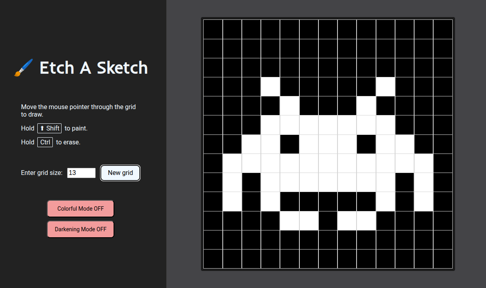
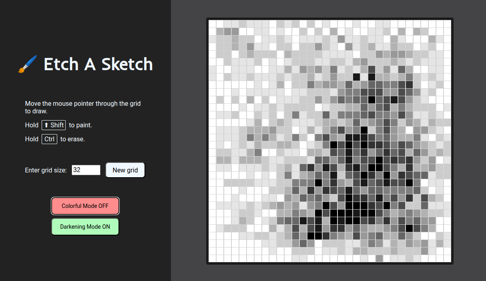
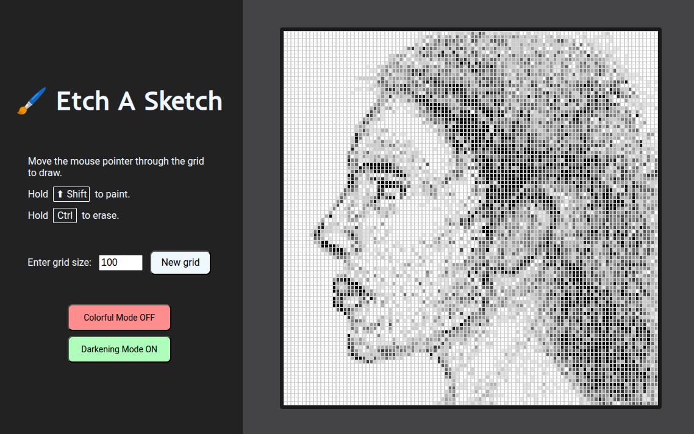
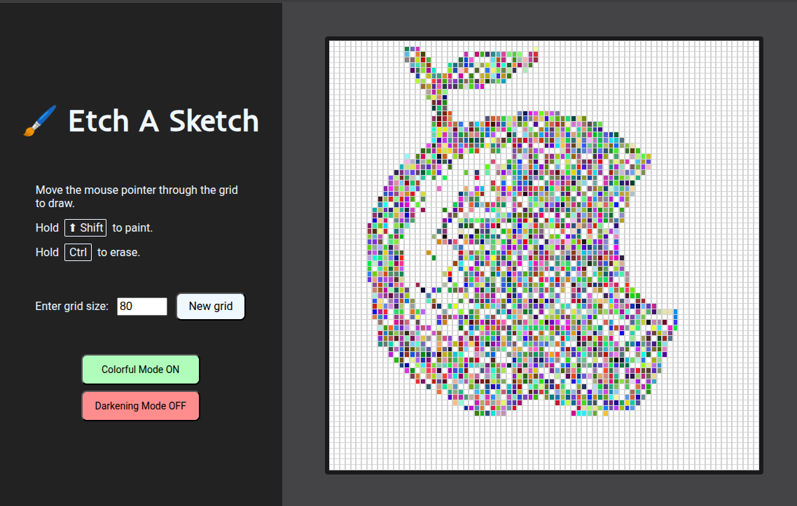

# Etch A Sketch

## Description

HTML + CSS + JavaScript project.

It's a browser version of a sketchpad. This sketchpad consists on a grid such that the user can paint or erase each square. It's possible to change the grid dimensions and toggle colorful and darkening modes.

In this project, I practiced a lot the use of events and manipulation of the DOM tree in JavaScript. I also added a very cool style to the interface.

## Live Demo

**[Click here](https://pedroasb.github.io/odin-foundations/etch-a-sketch/)** to try out this project on browser.

## Screenshots

