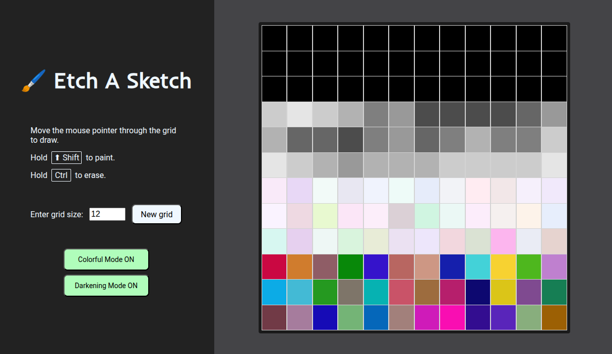

# Etch A Sketch

### Description

- HTML + CSS + JavaScript project.
- It's a browser version of a sketchpad. This sketchpad consists on a grid such that the user can paint or erase each square. It's possible to change the grid dimensions and toggle colorful and darkening modes.

### Screenshots

