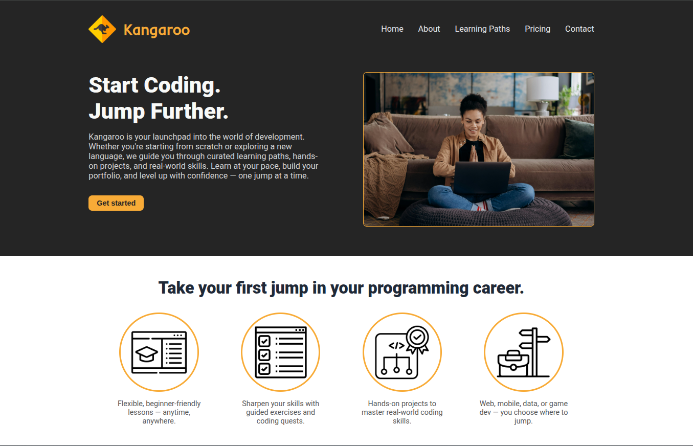
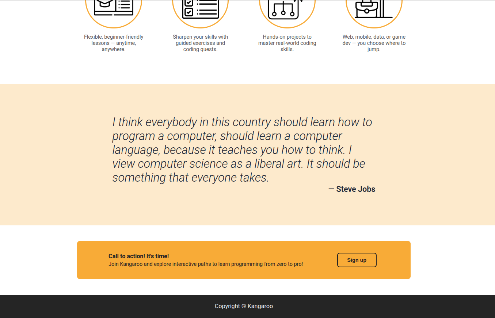

# Landing Page

## Description

HTML + CSS project (using flexbox).

It's a landing page for a fictional online programming courses platform called Kangaroo.

This was my second project using HTML and CSS, where the objective was to learn how to use flexbox in CSS. This tool has now become part of my front-end repertoire.

It was initially implemented as a template for a generic landing page, which can be found in `/landing-page/template-version/`.

## Live Demo

**[Click here](https://pedroasb.github.io/odin-foundations/landing-page/)** to try out this project on browser.

## Screenshots

## Attributions

- <a href="https://www.pexels.com/photo/man-person-woman-hand-6894013/" title="mikhail-nilov-photo">Header Photo by Mikhail Nilov</a>
- <a href="https://www.flaticon.com/free-icons/kangaroo" title="kangaroo icons">Kangaroo icons created by Freepik - Flaticon</a>
- <a href="https://www.flaticon.com/free-icons/lesson" title="lesson icons">Lesson icons created by Freepik - Flaticon</a>
- <a href="https://www.flaticon.com/free-icons/list" title="list icons">List icons created by phatplus - Flaticon</a>
- <a href="https://www.flaticon.com/free-icons/project" title="project icons">Project icons created by Iconjam - Flaticon</a>
- <a href="https://www.flaticon.com/free-icons/career-option" title="career option icons">Career option icons created by Uniconlabs - Flaticon</a>
